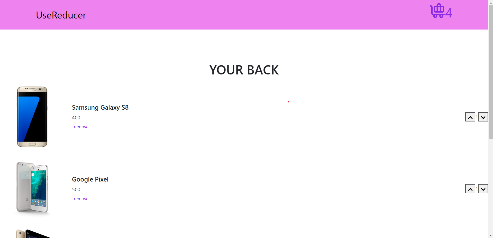

# Project Title

App Store .

## Table of Contents

- [Project Overview](#project-overview)
- [Features](#features)
- [Technologies Used](#technologies-used)
- [Screenshot](#screenshot)

## Project Overview

Task make you add items to your bag and remove from it  .

## Features

- Feature 1: you can know the whole price.
- Feature 2: you can canel all order.
- Feature 3: you can delete any product and automatically it price canceled.

## Technologies Used

- React: For building the user interface.
- Bootstrap: For styling the UI.

## Screenshot 

